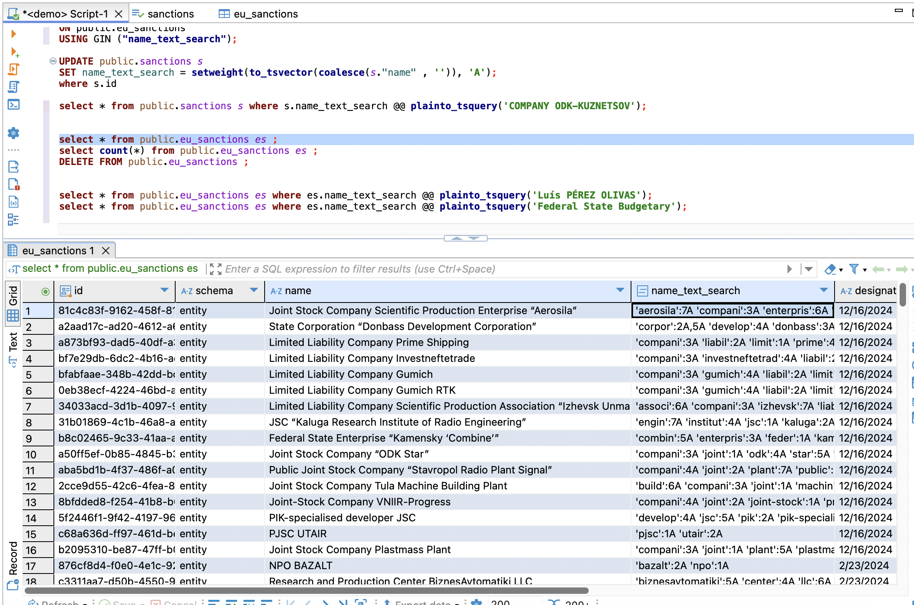
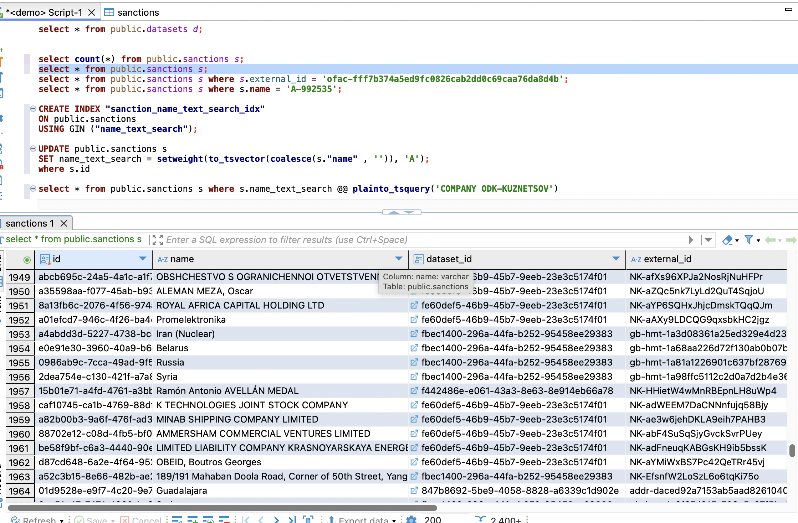
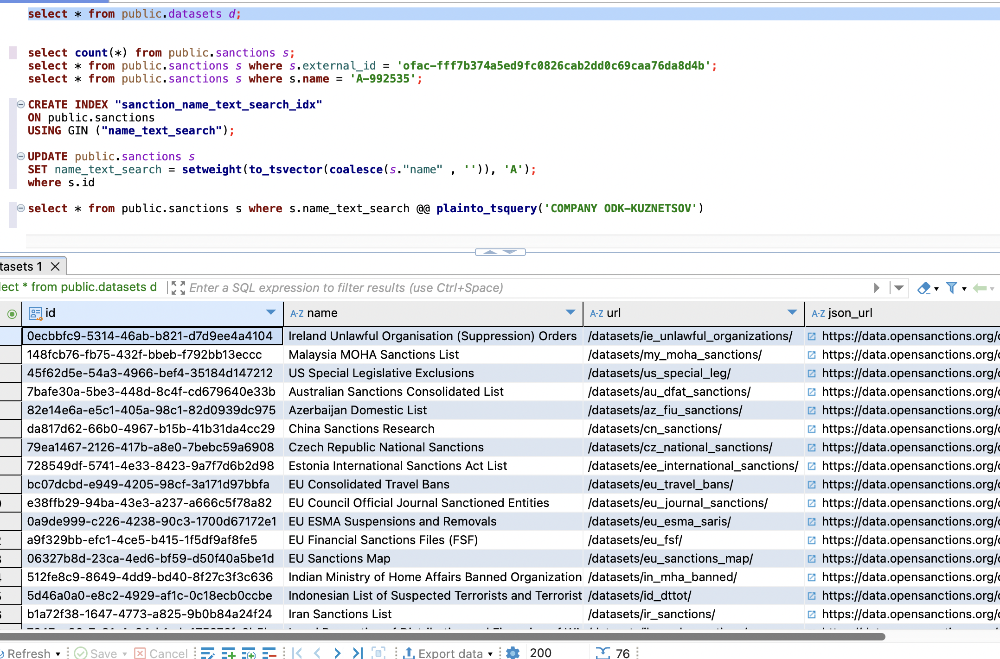

## Redis:

Run `docker run -d --name redis-server -e REDIS_PASSWORD=yourpassword -p 6379:6379 redis:latest redis-server --requirepass yourpassword`

## Playwright:

`yarn playwright install`

## Special index for text search

```
CREATE INDEX "sanction_name_text_search_idx"
ON public.sanctions
USING GIN ("name_text_search");
```

```
CREATE INDEX "eu_sanction_name_text_search_idx"
ON public.eu_sanctions
USING GIN ("name_text_search");
```

```
UPDATE public.sanctions s
SET name_text_search = setweight(to_tsvector(coalesce(s."name" , '')), 'A');
```

```
select * from public.sanctions s where s.name_text_search @@ plainto_tsquery('COMPANY ODK-KUZNETSOV')
```

## Open Sanction Usage:

First: Use GET `/open-sanction/datasets/sync` to synchronize datasets into db

Second: use GET `/open-sanction/sanctions/sync` to synchronize sanctions into db

## Data:

### EU Sanctions:



### Opens Sanctions:



### Open Sanction Datasets:


